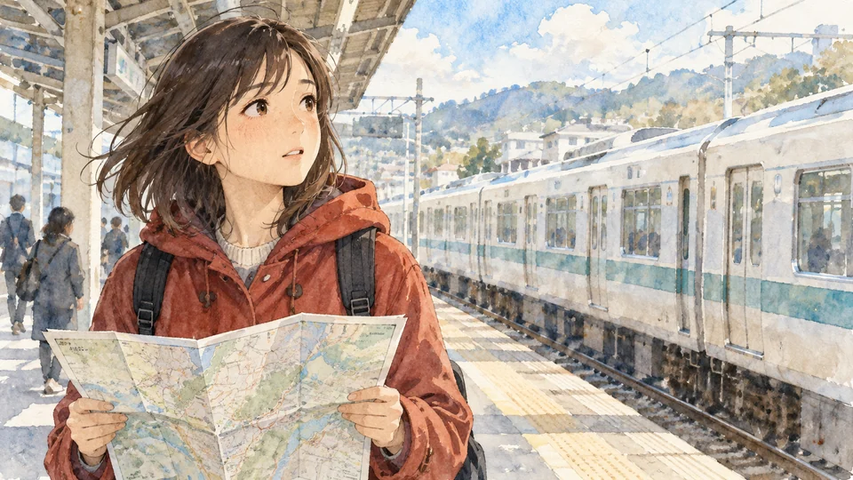
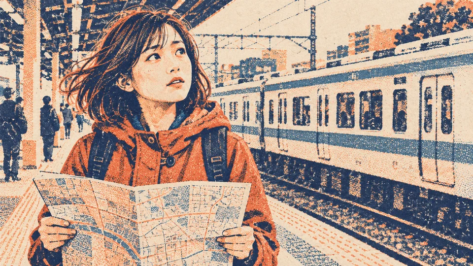
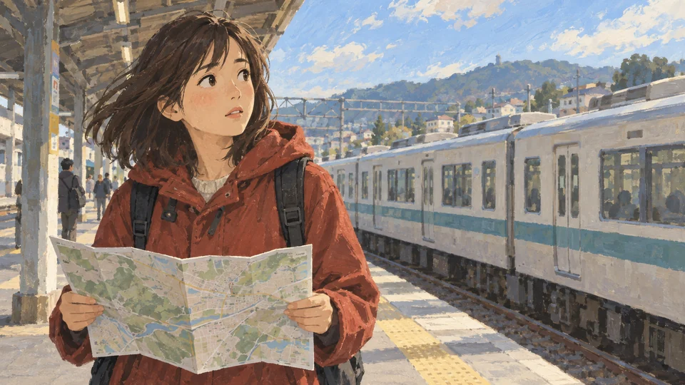
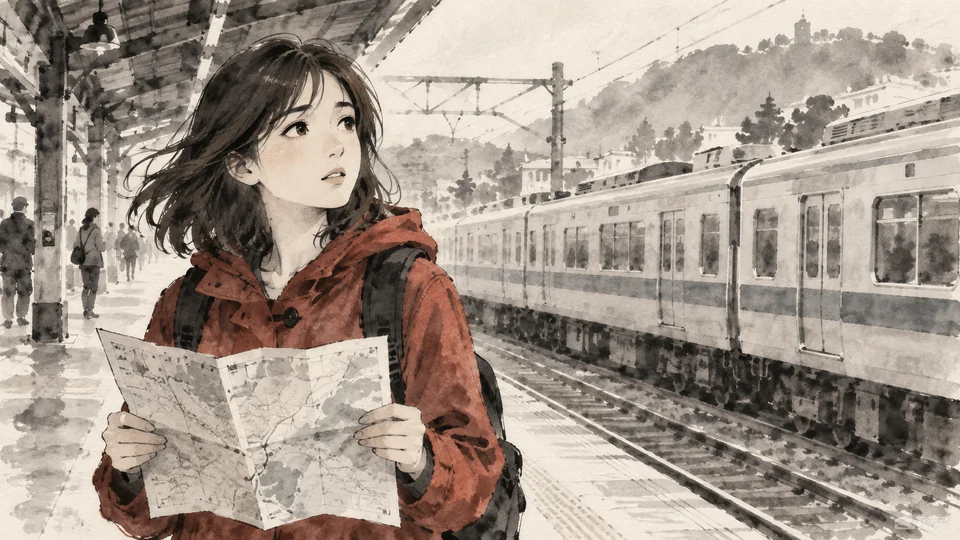
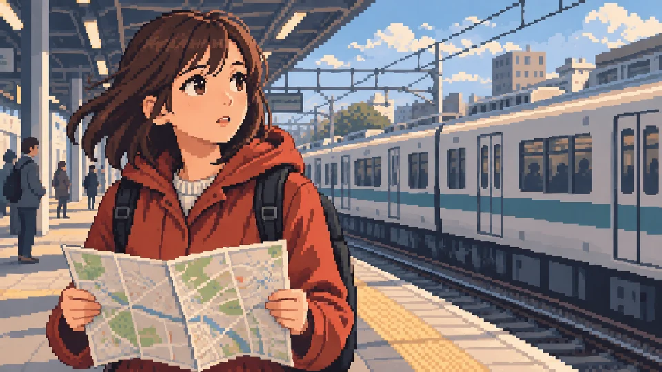
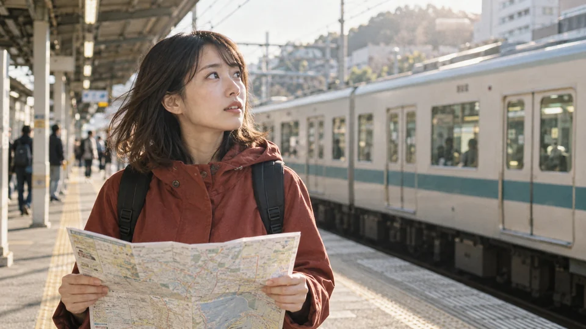

# Prompt Library — ChatGPT image generation

Use these as two independent pieces: a character and scene prompt for the gallery example, and a visual style prompt for the rendering treatment. To make your own image in a style, write your own subject description and paste only that style's prompt after it. To approach a gallery example, paste the shared character and scene prompt followed by its style prompt.

The gallery images were selected from outputs generated after submitting these combined prompt parts. The exact submitted text and each image checksum are recorded in [`site/benchmark-manifest.json`](site/benchmark-manifest.json). The image tool did not expose a seed or underlying model version, so the same prompt can produce a different composition on another run.

Text prompts target the visible technique, not an identical image. For a closer match to a gallery image, attach that image in ChatGPT as a visual reference and say to preserve its medium, mark making, palette, and texture while following your subject description. Keep the same image model and output shape when comparing results, then inspect repeated generations. [OpenAI's image prompting guide](https://developers.openai.com/api/docs/guides/image-prompting) describes reference-based edits and consistency checks.

## Character and scene — shared benchmark

Benchmark ID: `station-map-v3` · Version: `3.0`. This prompt deliberately contains the person, pose, setting, and composition. It can be replaced in full when you want a different subject.

```text
Create one wide 16:9 landscape image, with no border or typography. A young adult East Asian woman with shoulder-length dark brown hair blowing gently to the left and expressive brown eyes wears a rust-red hooded coat and a black backpack. She holds an unfolded paper map in both hands at chest level, with the entire map visible near the lower edge. Frame her from the waist up in a medium close-up, slightly left of center: her head, torso, and map should fill most of the left half of the image. Her body is turned three-quarters to the right, and she looks up toward the right with a curious, slightly uncertain expression. She stands on a sunlit outdoor commuter-train platform. A long white commuter train with a muted teal stripe remains clearly visible across the right half of the background. The platform canopy and columns recede diagonally from the upper left; a few indistinct commuters stand far behind her. Keep the woman, map, platform, and train all clearly visible.
```

## Visual style prompts

### Watercolor



Copy this section by itself after your own subject description. It intentionally does not describe the gallery character or train platform.

```text
Render the subject as a hand-painted watercolor illustration with contemporary Japanese animation-inspired drawing when people appear: simplified expressive faces and very fine pencil-like contours, never photorealistic skin. Layer transparent pigment over visible cold-press paper. Let pale powder-blue and warm beige washes bleed and pool softly in the background while retaining crisp, delicate detail at the focal face and hands. Leave luminous paper-white highlights and use one richer warm accent from the subject. The result should feel airy and visibly painted with water. Avoid realistic portrait rendering, opaque digital paint, thick black outlines, and smooth computer gradients.
```

**Watch for:** If every edge is sharp and opaque, the result can read as digital painting rather than watercolor.

### Risograph



Copy this section by itself after your own subject description. It intentionally does not describe the gallery character or train platform.

```text
Render the subject as a two-color risograph print on warm off-white uncoated paper. Use only deep midnight-navy and warm coral-orange spot inks, plus the third dark tone formed where they overlap; let the paper supply the light areas. Reduce the image to bold graphic shapes and strong contours. If a person appears, keep their expression readable through simplified comic-like features. Build midtones from coarse halftone dots and irregular ink grain, with slight visible misregistration between the two plates and imperfect ink coverage. Avoid full-color gradients, clean vector flatness, photographic shading, and uniform digital-noise overlays.
```

**Watch for:** A uniform digital noise overlay is not a substitute for uneven ink and interacting color layers.

### Gouache



Copy this section by itself after your own subject description. It intentionally does not describe the gallery character or train platform.

```text
Render the subject as an opaque gouache illustration with the warmth of hand-painted Japanese animation background art. Use broad, confident matte color shapes, layered opaque paint, softly visible bristle marks, and edges shaped by the brush rather than heavy ink outlines. If a person appears, give them simplified expressive drawn features. Balance muted powder blues, warm stone neutrals, and one earthy red accent; let soft daylight separate foreground and distance. Preserve enough surface texture to feel painted on paper. Avoid transparent watercolor blooms, glossy acrylic shine, photorealistic skin, and perfectly smooth vector fills.
```

**Watch for:** Excess shine or transparent washes can make the image look like acrylic or watercolor instead.

### Ink Wash



Copy this section by itself after your own subject description. It intentionally does not describe the gallery character or train platform.

```text
Render the subject as an expressive ink-wash illustration on absorbent off-white paper. Build almost the entire image from black ink diluted into soft gray tonal washes, reserved white paper, and a few energetic dark calligraphic marks. When a person appears, use delicate manga-inspired contour lines around the face and hands, with simplified expressive features. Permit a single muted rust-red accent on the main subject; reinterpret every other color specified in the subject description as grayscale, including clothing and background details. Let distant forms dissolve into wet washes while focal details remain legible. Avoid photographic grayscale, full-color watercolor, polished digital gradients, and uniformly heavy outlines.
```

**Watch for:** Pure grayscale with photographic shading misses the expressive role of brush marks and open paper.

### Pixel Art



Copy this section by itself after your own subject description. It intentionally does not describe the gallery character or train platform.

```text
Render the subject as carefully authored 2D pixel art for a narrative adventure game. Design on a low-resolution pixel grid, roughly 320 by 180 logical pixels for a wide scene, then display it with crisp nearest-neighbor enlargement. Use a limited palette of navy, slate blue, warm cream, peach, and rust red. Build forms from intentional square pixel clusters, stepped contours, flat color bands, and discrete shade changes; use readable anime-inspired sprite features if people appear. Keep the background architecture legible without fine photographic detail. Avoid blur, antialiasing, smooth gradients, vector outlines, and a merely downsampled photograph.
```

**Watch for:** A blurry low-resolution picture is not pixel art; every cluster should look intentional.

### 35mm Film



Copy this section by itself after your own subject description. It intentionally does not describe the gallery character or train platform.

```text
Render the subject as a candid photograph on 35mm color negative film, not an illustration. Use a natural 50mm documentary viewpoint, available light, gentle backlight when the scene permits, soft highlight rolloff, muted warm highlights, and slightly cool teal shadows. Keep the primary subject in believable focus while the background softens naturally through lens depth of field. If a person appears, preserve natural anatomy and an unposed expression. Add fine organic grain and slight exposure variation in the image itself, without making it look like a digital noise filter. Favor an observed everyday moment over polished commercial staging. Avoid airbrushed skin, heavy cinematic color grading, extreme bokeh, and painterly or anime rendering.
```

**Watch for:** An aggressive grain overlay alone will not create believable lens, light, and color behavior.
